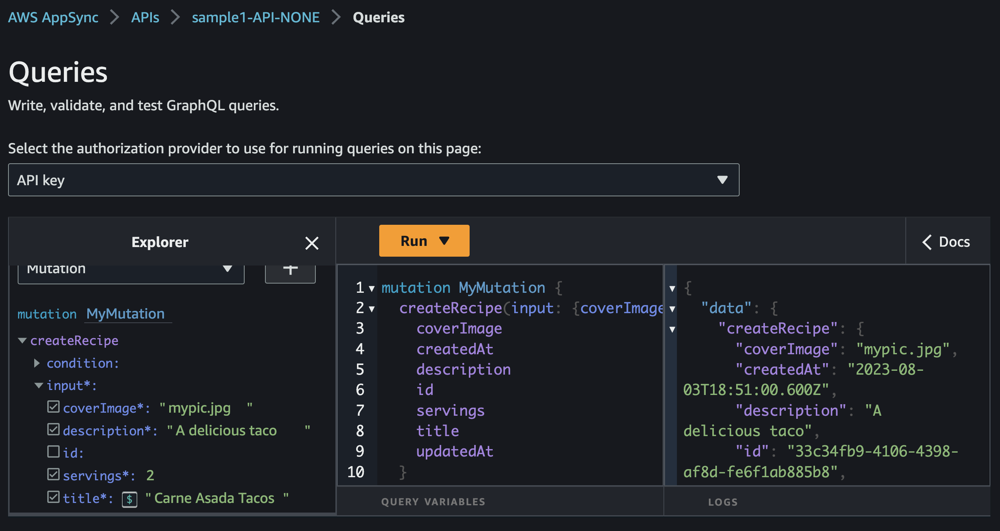

# Getting Started

This section will walk you through how to setup and deploy your first API using the Amplify GraphQL L3 construct. By the end, you'll have a deployed API that is ready to be tested in the AWS Console or a frontend application.

## Creating a new CDK project

We'll use TypeScript as our CDK language in this and the subsequent sections. Create a new CDK project by running the following command in an empty directory:

```sh
npx aws-cdk init -l typescript
```

Once installed, open up the project in your code editor.

## Installing the L3 construct

Installation of the construct can be achieved by running the following command:

```sh
npm i @aws-amplify/graphql-construct-alpha
```

## Project structure

This guide and the subsequent tutorials will work from a single CDK stack. To keep code organized, each CDK construct will live in its own directory, and invoked in our stack file.

This means inside of our `lib` directory, we'll create a new directory called `api` and within that, create 2 files: `appsync.ts` and `schema.graphql`.


These are the only two files we'll be creating to get our application deployed 🤯

## Creating a Schema

For this example, we'll create a `Recipe` API. Traditionally, when using the AWS AppSync , this would mean creating something along the following lines:

```graphql
type Query {
	getRecipe(id: String): Recipe @aws_cognito_user_pools
	listRecipes: [Recipe]! @aws_cognito_user_pools
}

type Mutation {
	createRecipe(input: RecipeCreateInput!): Recipe @aws_cognito_user_pools
	updateRecipe(input: RecipeUpdateInput!): Recipe @aws_cognito_user_pools
	deleteRecipe(id: String!): Recipe @aws_cognito_user_pools
}

type Recipe {
	id: ID!
	coverImage: String!
	title: String!
	description: String!
	servings: Int!
}
```

From there, you'd have to create your resolvers and your API.

With this construct, the schema guides what resources get created.

In your `schema.graphql` file, add the following:

```graphql
type Recipe @model @auth(rules: [{ allow: public }]) {
	id: ID!
	coverImage: String!
	title: String!
	description: String!
	servings: Int!
}
```

> 🗒️ Adding auth directives will be covered in a following section.

That's it! This will tell our construct to create a DynamoDB table, the resolvers, and the operations.

## Creating our API

The goal of the CDK construct is to have it take away the boring, while still allowing for the custom. Most apps need a CRUD API, however they also want the flexibility to create a specific operations and pieces of functionality.

That's where this construct shines.

In the following sections, we'll dive into how to create more robust APIs, but in this example, paste the following into the `lib/appsync.ts` file:

```ts
import { Construct } from 'constructs'
import * as awsAppsync from 'aws-cdk-lib/aws-appsync'
import * as path from 'path'
import { AmplifyGraphqlApi } from '@aws-amplify/graphql-construct-alpha'
import { Duration } from 'aws-cdk-lib'

type AppSyncAPIProps = {
	appName: string
}

export function createAmplifyGraphqlApi(
	scope: Construct,
	props: AppSyncAPIProps
) {
	const apiName = `${props.appName}-API`

	const amplifyAppSyncAPI = new AmplifyGraphqlApi(scope, apiName, {
		apiName,
		schema: awsAppsync.SchemaFile.fromAsset(
			path.join(__dirname, './schema.graphql')
		),
		authorizationConfig: {
			defaultAuthMode: awsAppsync.AuthorizationType.API_KEY,
			apiKeyConfig: {
				expires: Duration.days(30),
			},
		},
	})

	return amplifyAppSyncAPI
}
```

The nice thing here is that for CDK developers, this should look familiar to how AppSync APIs are created today. For frontend developers use to JavaScript/TypeScript, this is easy enough to parse: An API is created by taking in a schema and setting how the API should be authenticated.

This `createAmplifyGraphqlApi` function needs to be called. To do that, we'll add it to our stack.

## Adding the API to a CDK Stack

In your stack file within the `lib` directory, add replace the contents with the following:

```ts
import * as cdk from 'aws-cdk-lib'
import { Construct } from 'constructs'
import { createAmplifyGraphqlApi } from './api/appsync'

export class Sample1Stack extends cdk.Stack {
	constructor(scope: Construct, id: string, props?: cdk.StackProps) {
		super(scope, id, props)

		const amplifyGraphQLAPI = createAmplifyGraphqlApi(this, {
			appName: 'sample1',
		})
	}
}
```

With this in place, we are ready to deploy our API.

## Deploying the API

In the `bin` directory, there should be a single TypeScript file. Replace the contents with the following:

```ts
#!/usr/bin/env node
import 'source-map-support/register'
import * as cdk from 'aws-cdk-lib'
import { Sample1Stack } from '../lib/sample1-stack'

const app = new cdk.App()
new Sample1Stack(app, 'Sample1Stack', {
	// change this account and region to values that you prefer
	env: { account: '123456789012', region: 'us-east-1' },
})
```

> 🗒️ Be sure to change the account and region to values for your AWS account.

To deploy the our Stack, we'll run the following command from the terminal to deploy the stack to your default profile (feel free to change if you use a different profile):

```sh
npx aws-cdk deploy --profile default
```

> 🗒️ If you get an error about "bootstrapping your environment", ensure you have valid CDK bootstrap setup by running `cdk bootstrap aws://ACCOUNT-NUMBER-/REGION`

As the stack is deploying, you should see a progression similar to the following:


Once completed, you should see outputs relating to your API:


## Testing your API

The outputs can be put into an AWS Amplify frontend application for testing:

```ts
//frontend/config.ts
export const config = {
	aws_project_region: ' ',
	aws_appsync_graphqlEndpoint: ' ',
	aws_appsync_region: ' ',
	aws_appsync_authenticationType: 'API_KEY',
}
```

Or by logging into the AWS AppSync console and creating a Recipe:


Congratulations--you've just created a working AppSync API tied to a DynamoDB database🎉

In the following sections, we'll build off of this example and explore how this construct fits into more practical application development.
