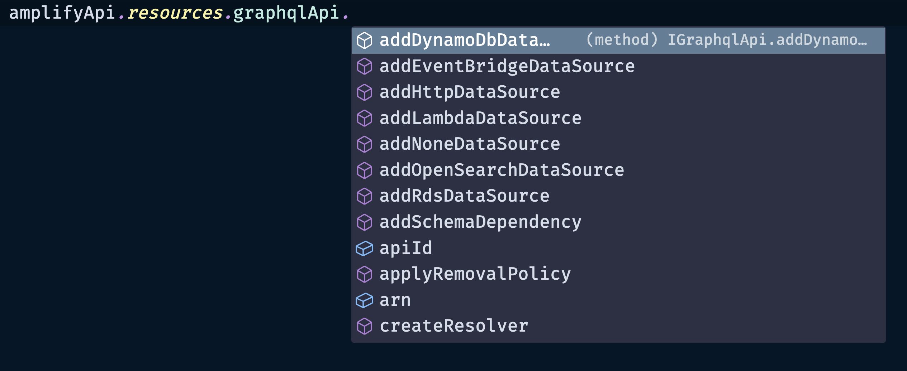

# Access the AppSync API and Generated Table

There are times when you may need to drop down a level to perform some operation that is either new or not directly supported within the L3 construct.

This section provides several ways of accessing the underlying L1 and L2 AppSync API and DynamoDB constructs.

Note that this is subject to change as [**improvements are made**](https://github.com/aws-amplify/amplify-category-api/pull/1756).

> 🚨 As improvements are made, this section is likely the most subject to change.

## AppSync

```ts
// access the L2 construct
amplifyApi.resources.graphqlApi.addDynamoDbDataSource()
```



```ts
// access the L1 construct
amplifyApi.resources.cfnGraphqlApi.xrayEnabled = true
```

## DynamoDB

```ts
// access the L2 construct
amplifyApi.resources.tables['RecipeTable'].tableArn
```


```ts
// access the L1 construct
amplifyApi.resources.cfnTables['RecipeTable'].attrArn
```
